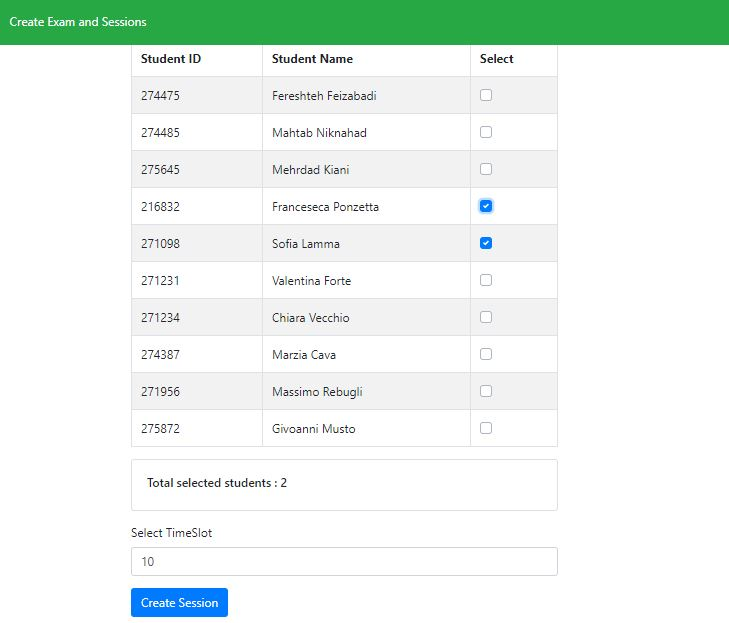

# Exam #274475: "Oral Exam Scheduling"
## Student: s274475 Feizabadi Fereshteh 

## React client application routes

- Route `/role`: Select role : student or teacher
- Route `/login`: Teacher Login
- Route `/studentLogin`: Student Login
- Route `/createExam`: Select students and define time slot and Create an Exam 
- Route `/addSession`: Define a session or many for that exam and selected students,shows available slots
- Route `/examSlots`: To Take oral exam by teacher,update mark and attendance of student
- Route `/resultView`: To show the results of all selected students
- Route `/StudentExams`: To show list of student's exams to book slot for that exam
- Route `/slots/:examId`: To show list of free slots for that exam
- Route `/bookedSlots`: To show booked slots of student

## REST API server

- GET `api/user`
  - request parameters : user's id (in parameter and in cookie) (for authentication)
  - response body: username , id  , course Id
 
- POST `api/login`
  - request body: email , password
  - response body: email , id , course Id , cookie of the user

- POST `api/logout`
  - clear cookie

- POST `/api/studentlogin`
  - request body: studentId 
  - response body: sid , studentId ,fullname  

- GET `/api/slots/:examId`
  - request parameters : examId (in parameter) 
  - response body: slots Json 
  
- PUT `/api/bookedSlots/:examId`
  - request parameters : examId (in parameter) , studentId (in body)
  - response body: nothing

- GET `/api/bookedSlots/:studentId`
  - request parameters : studentId (in parameter) 
  - response body: slots Json 
  
- GET `/api/StudentExams/:studentId`
  - request parameters : studentId (in parameter) 
  - response body: exams Json 

- GET `/api/exams/:examId`
  - request parameters : examId (in parameter) 
  - response body: exam Json 
 
- PUT `/api/slots/:slotId`
  - request parameters : slotId (in parameter) 
  - response body: slot Json 
  
- PUT `/api/exam_student/:slotId`
  - request parameters : body 
  - response body: updated exam slot Json 

- GET `/api/studentsofcourse`
  - request parameters : cid of teacher 
  - response body: students Json   

- POST `/api/addSession`
  - request parameters : session parameters in body
  - response body: session Id
  
- POST `/api/createExam`
  - request parameters : exam parameters in body
  - response body: exam Id
 
- GET `/api/examSlots/:courseId`
  - request parameters : course Id (in parameter)
  - response body: timeslots json 
  
- GET `/api/resultView/:courseId`
  - request parameters : course Id (in parameter)
  - response body: results json 
    
- PUT `/api/oralExamItem/:studentId`
  - request parameters : student Id (in parameter), exam Id in body
  - response body: nothing 
  	
	

## Server database

- Table `users(teachers)` - contains: id, email, name, hash, cid
- Table `students` - contains: sid, fullname, studentId
- Table `student_exam` - contains: studentId, examId, state,mark,attendance,withdraw,cid,slotId
- Table `student_course` - contains: studentId, cid, tid
- Table `slots` - contains: slotId, state, date,eid
- Table `exams` - contains: eid, cid, slotDuration
- Table `courses` - contains: cid, name

## Main React Components

- `StudentLogin` (in `StudentLogin.js`): Student login 
- `StudentExamsList` (in `StudentExamsList.js`): List of student exams 
- `SelectRole` (in `SelectRole.js`): To select teacher or student 
- `SelectRole` (in `SelectRole.js`): To select teacher or student 
- `OralExamList` (in `OralExamList.js`): List of slots for taking exam
- `OralExamItem` (in `OralExamItem.js`): Slot item of list of slots for taking exam
- `LoginForm` (in `LoginForm.js`): Teacher login
- `Header` (in `Header.js`): Header of page for login, logout and shows the user name and links
- `FreeSlotsList` (in `FreeSlotsList.js`): To show free slots of exam for booking 
- `ExamResult` (in `ExamResult.js`): To show list of exam result to teacher 
- `DefineSession` (in `DefineSession.js`): To define session for exam and shows number of available slots
- `CreateExam` (in `CreateExam.js`): To select students, slot duration and create an exam 
- `BookedSlotsList` (in `BookedSlotsList.js`): To show list of booked slots to student
- `BookedExamItem` (in `BookedExamItem.js`): Booked exam item of slots list for student 
 

## Screenshot

## Test users

* fulvio.corno@polito.it, password (frequent)
* alberto.monge@polito.it, password

